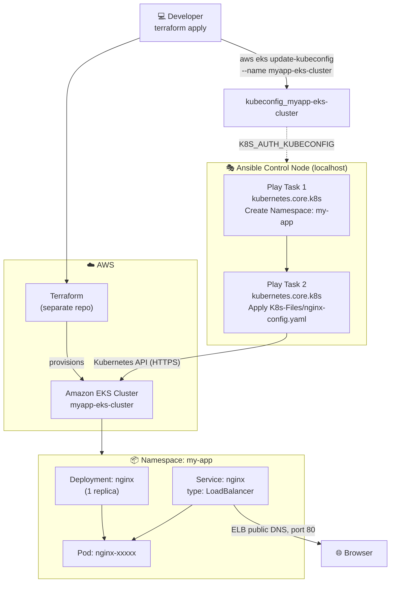
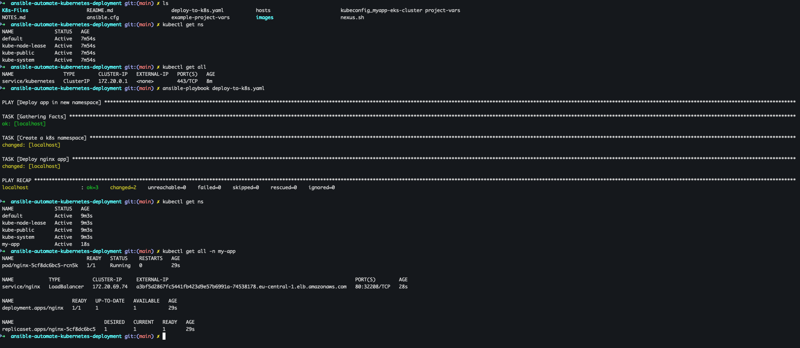
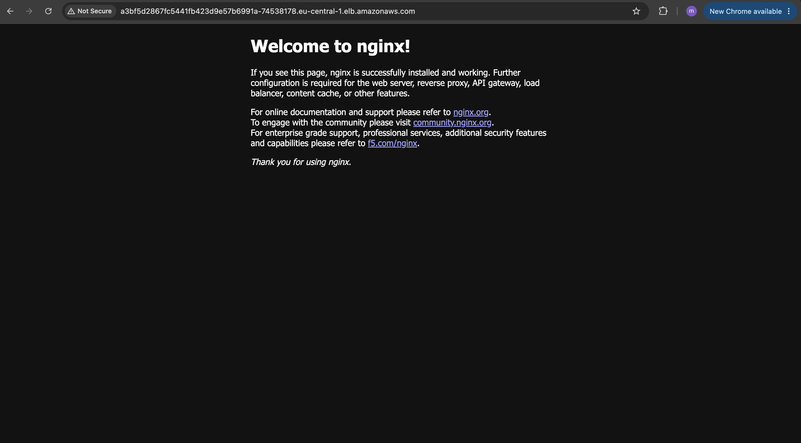

# 🚀 Ansible Automate Kubernetes Deployment


**Terraform** is an infrastructure as code (IaC) tool that lets you build, change, and version infrastructure safely and efficiently. It works with resources from cloud providers as well as on-prem services, describing infrastructure using a high-level configuration language called **HCL (HashiCorp Configuration Language)**. Terraform generates an execution plan describing what it will do to reach the desired state, and then executes it to build the described infrastructure, keeping track of the real-world resources it manages in a **state file**.

**Ansible Automation** is an open-source, agentless IT automation engine that automates provisioning, configuration management, application deployment, and orchestration across large fleets of servers. It describes the *desired state* of a system using simple, human-readable YAML files called **playbooks**, and pushes those changes to managed nodes over standard **SSH** — without requiring any agent, daemon, or extra software installed on the target machines. Because every module is designed to be **idempotent**, running the same automation twice produces the same end state without unintended side effects, which makes Ansible a safe, repeatable and auditable way to manage infrastructure at scale.

## 📖 Overview

This project demonstrates how **Ansible** can act as the deployment orchestrator on top of a **Kubernetes** cluster, rather than only configuring traditional VMs over SSH. An **Amazon EKS** cluster is first provisioned with **Terraform**, after which Ansible — using its `kubernetes.core` Collection and the Kubernetes **Python client** — talks directly to the cluster's API server to create a dedicated namespace and roll out an application into it, completely replacing manual `kubectl apply` commands with a single, repeatable playbook run.

### ✨ Ansible Automation key features

- 🔓 **Agentless architecture** — connects to managed nodes purely over SSH (or, as in this project, talks directly to an API such as the Kubernetes API server), so there is nothing to install or maintain on the target systems
- 📝 **Human-readable YAML playbooks** — automation logic is expressed as simple, declarative YAML instead of custom scripting
- 🔁 **Idempotency** — tasks can be run repeatedly and will only change the system when it drifts from the desired state (re-running this playbook will not create duplicate namespaces or re-deploy an already up-to-date manifest)
- 🧩 **Modular building blocks** — reusable **Modules**, **Roles** and **Collections** let automation be composed, shared and version-controlled
- ⚡ **Ad-hoc command execution** — one-off tasks can be run instantly across a fleet without writing a full playbook
- 🗂️ **Flexible inventory management** — plays can target real remote hosts, groups, or `localhost` itself (as in this project) when the automation's job is to call out to an external API rather than configure a machine over SSH
- 🔌 **Extensibility via Collections** — specialized Collections like **`kubernetes.core`** extend Ansible far beyond traditional server configuration, letting it manage Kubernetes resources (namespaces, deployments, services) the same declarative way it manages packages and files
- 🏪 **Ansible Galaxy** — a public registry for discovering and sharing community-built roles, modules and collections
- 🔒 **Secure secrets handling** — sensitive data (passwords, keys, tokens, kubeconfig paths) can be externalized into `vars_files` and encrypted at rest using **Ansible Vault**
- 🎯 **Infrastructure-as-code integration** — Ansible plays nicely downstream of Terraform: once Terraform provisions the underlying infrastructure (here, an EKS cluster), Ansible takes over to configure what runs *on top of it*, exactly as demonstrated in this project

## Demo Project

Ansible Automate Kubernetes Deployment

## Technologies used

- Ansible
- Terraform
- Kubernetes
- AWS EKS
- Python
- Linux

## Project Description

- Create EKS cluster with Terraform
- Write Ansible Play Pipelines to deploy application in a new K8s namespace

## 📁 Repository structure

```text
ansible-automate-kubernetes-deployment/
├── NOTES.md                           # Personal study notes covering the full Ansible learning path
├── README.md                          # This file 📄
├── .gitignore                         # Excludes project-vars (holds local file paths) from git
├── ansible.cfg                         # Ansible configuration (default inventory, SSH behaviour)
├── hosts                               # Legacy static inventory file (unused by this localhost playbook)
├── deploy-to-k8s.yaml                  # Main playbook - creates namespace & deploys nginx into the EKS cluster
├── project-vars                         # Local, git-ignored vars file (nginx_deployment_file path)
├── example-project-vars                 # Template committed to the repo - copy to `project-vars`
├── kubeconfig_myapp-eks-cluster          # kubeconfig generated via `aws eks update-kubeconfig`
├── K8s-Files/                           # Raw Kubernetes manifests deployed by the playbook
│   └── nginx-config.yaml                 # nginx Deployment + LoadBalancer Service
└── images/                              # Screenshots captured while running the demo
    ├── ansible-playbook-success-terminal.png
    └── nginx-running-browser.png
```

> 📌 The Terraform configuration that provisions the EKS cluster itself lives in a separate, dedicated repository — [automate-provisioning-eks-cluster-with-terraform](https://github.com/mustafa-saleh/automate-provisioning-eks-cluster-with-terraform) — and is referenced rather than duplicated here, since this project's focus is the **Ansible → Kubernetes** deployment layer that runs on top of that cluster.

## 🏗️ Architecture overview



- **Terraform** (in its own repository) provisions the underlying **Amazon EKS cluster** and its worker nodes/node groups
- The AWS CLI's `aws eks update-kubeconfig` command generates a **kubeconfig** file, which becomes the credential/connection bridge between the local machine and the cluster's API server
- **Ansible runs entirely against `hosts: localhost`** — it never SSHes anywhere. Instead, each task in the play uses the **`kubernetes.core.k8s`** module to call the **Kubernetes API** directly (using the Python `kubernetes` client library under the hood), the same way `kubectl` does
- The playbook performs two idempotent steps: create the `my-app` **namespace**, then apply the [nginx-config.yaml](K8s-Files/nginx-config.yaml) manifest (a `Deployment` + a `LoadBalancer` `Service`) into that namespace
- AWS provisions an **Elastic Load Balancer** for the `LoadBalancer`-type service, exposing nginx on port 80 at a public DNS name

## 🧭 Implementation Guide

### 1. Prerequisites

Before running this automation, make sure you have the following in place:

- ✅ **Terraform installed** on your local/control machine, see [Terraform's install guide](https://developer.hashicorp.com/terraform/install)

  ```bash
  # macOS
  brew tap hashicorp/tap
  brew install hashicorp/tap/terraform
  ```

- ✅ **Ansible installed** on your local/control machine

  ```bash
  # macOS
  brew install ansible

  # or via pip (Ansible is written in Python)
  pip install ansible
  ```

- ✅ The **`kubernetes.core`** Ansible Collection installed, since the `k8s` module used throughout the playbook lives in it, see [Ansible Collection: kubernetes.core](https://docs.ansible.com/ansible/latest/collections/kubernetes/core/index.html)

  ```bash
  ansible-galaxy collection install kubernetes.core
  ```

- ✅ The Python packages the `kubernetes.core.k8s` module depends on, verified and installed with `pip`'s `--user` flag to avoid requiring `sudo`:

  ```bash
  python3 -c "import yaml"
  python3 -c "import kubernetes"
  python3 -c "import jsonpatch"

  # pip defaults to a system directory (/usr/local/lib/python3.x) which needs root;
  # --user installs to a user directory (~/.local/lib/python3.x) instead
  pip3 install --user pyyaml kubernetes jsonpatch
  ```

- ✅ The **AWS CLI** installed and configured with credentials that have access to the target EKS cluster, see [AWS CLI Documentation](https://docs.aws.amazon.com/cli/latest/userguide/getting-started-install.html)
- ✅ A local copy of the git-ignored vars file, created from the template committed to the repo:

  ```bash
  cp example-project-vars project-vars
  ```

### 2. Provision the EKS cluster with Terraform

The EKS cluster backing this project was provisioned using the dedicated Terraform configuration from [automate-provisioning-eks-cluster-with-terraform](https://github.com/mustafa-saleh/automate-provisioning-eks-cluster-with-terraform):

```bash
terraform init
terraform plan
terraform apply
```

This creates the EKS **control plane**, the supporting **VPC/subnets**, and a managed **node group** that the cluster schedules workloads onto.

### 3. Generate the kubeconfig for the new cluster

Once the cluster is up, the AWS CLI generates a dedicated kubeconfig file scoped to this cluster, keeping it separate from any other clusters already configured on the local machine:

```bash
aws eks update-kubeconfig --region eu-central-1 --name myapp-eks-cluster --kubeconfig ./kubeconfig_myapp-eks-cluster
```

This produces [kubeconfig_myapp-eks-cluster](kubeconfig_myapp-eks-cluster) — containing the cluster's API server endpoint, certificate authority data, and an `aws eks get-token`-based authenticator entry that `kubectl`/Ansible use to authenticate.

To point all subsequent `kubectl`/Ansible commands at this specific cluster:

```bash
export KUBECONFIG=./kubeconfig_myapp-eks-cluster
kubectl get namespaces -n my-app
```

Alternatively, exporting **`K8S_AUTH_KUBECONFIG`** lets every task inside the `kubernetes.core.k8s` module pick up the same kubeconfig automatically, without needing to repeat a `kubeconfig:` parameter in every single task:

```bash
export K8S_AUTH_KUBECONFIG=./kubeconfig_myapp-eks-cluster
```

### 4. Write the Kubernetes manifest to deploy

[K8s-Files/nginx-config.yaml](K8s-Files/nginx-config.yaml) is a standard, plain Kubernetes manifest — no Ansible-specific syntax at all — describing an nginx **Deployment** and an accompanying **Service**:

```yaml
---
apiVersion: apps/v1
kind: Deployment
metadata: 
  name: nginx
  labels:
    app: nginx
spec:
  selector:
    matchLabels:
      app: nginx
  replicas: 1  
  template:
    metadata:
      labels:
        app: nginx
    spec:
      containers:
      - name: nginx
        image: nginx
        ports:
        - containerPort: 80
---
apiVersion: v1
kind: Service
metadata:
  name: nginx
  labels:
    app: nginx
spec:
  ports:
  - name: http
    port: 80
    protocol: TCP
    targetPort: 80
  selector:
    app: nginx
  type: LoadBalancer
```

- The **Deployment** runs a single nginx replica, listening on container port 80
- The **Service** is of type **`LoadBalancer`**, which on EKS automatically provisions an AWS **Elastic Load Balancer** and routes external traffic on port 80 to the matching nginx pod(s)

Keeping this as a plain Kubernetes manifest (rather than re-writing it as inline Ansible tasks) means it can be validated, diffed and applied with plain `kubectl` too — Ansible is simply automating *when* and *how* it gets applied.

### 5. Write the Ansible Playbook to deploy into a new namespace

[deploy-to-k8s.yaml](deploy-to-k8s.yaml) is the core automation of this project — a single play, targeting `localhost`, with two tasks:

```yaml
---
- name: Deploy app in new namespace
  hosts: localhost
  vars_files:
    - project-vars
  tasks:
    - name: Create a k8s namespace
      kubernetes.core.k8s:
        name: my-app
        api_version: v1
        kind: Namespace
        state: present
    - name: Deploy nginx app 
      kubernetes.core.k8s:
        src: "{{nginx_deployment_file}}"
        state: present
        namespace: my-app
```

- `hosts: localhost` — this play never connects to a remote server over SSH; every task executes on the Ansible control node itself, which then talks to the Kubernetes API over HTTPS using the kubeconfig picked up from `K8S_AUTH_KUBECONFIG`
- **Task 1** uses `kubernetes.core.k8s` with `kind: Namespace` and `state: present` to **idempotently** create the `my-app` namespace — running this task again when the namespace already exists simply reports `ok` instead of failing or duplicating anything
- **Task 2** uses the same module, but instead of inline `kind`/`metadata` fields, points `src:` at the externalized [K8s-Files/nginx-config.yaml](K8s-Files/nginx-config.yaml) manifest and explicitly targets the `my-app` namespace, applying both the Deployment and the Service in one task
- `vars_files: - project-vars` externalizes the manifest's file path (`nginx_deployment_file`) instead of hardcoding it directly in the task, matching the project's git-ignore convention for local-path/secret values:

  ```yaml
  nginx_deployment_file: ./K8s-Files/nginx-config.yaml
  ```

### 6. Run the playbook

With the Collection, Python dependencies, and `KUBECONFIG`/`K8S_AUTH_KUBECONFIG` all in place, the entire namespace + application deployment is triggered with a single command:

```bash
ansible-playbook deploy-to-k8s.yaml
```

Ansible gathers facts on `localhost`, creates the `my-app` namespace, and applies the nginx manifest into it — reporting `changed` for both tasks on a first run:



The terminal capture above also shows the cluster **before and after**: `kubectl get ns` initially lists only the default Kubernetes system namespaces, then — after the playbook's `PLAY RECAP` reports `ok=3 changed=2 failed=0` — a new `my-app` namespace appears, with `kubectl get all -n my-app` confirming the `nginx` **Pod**, **Service** (type `LoadBalancer`, with its AWS ELB `EXTERNAL-IP`), **Deployment** and **ReplicaSet** are all up and `Running`.

### 7. Verify the deployment

With the `LoadBalancer` service provisioned, the AWS-generated ELB DNS name shown in `kubectl get all -n my-app` is reachable directly from a browser:

```bash
kubectl get svc nginx -n my-app
# EXTERNAL-IP column shows something like:
# a3bf5d2867fc5441fb423d9e57b6991a-74538178.eu-central-1.elb.amazonaws.com
```



The default **"Welcome to nginx!"** page confirms the container is running inside the `my-app` namespace on the EKS cluster and is reachable end-to-end through the AWS Load Balancer that Kubernetes provisioned automatically.

## ✅ Final result

By the end of this demo:

- ☸️ An **Amazon EKS cluster** was provisioned via Terraform and a dedicated **kubeconfig** was generated with the AWS CLI to connect to it
- 🧩 Ansible's **`kubernetes.core`** Collection (backed by the Python `kubernetes` client) was used to talk directly to the Kubernetes API — no SSH, no remote inventory, just `hosts: localhost`
- 📦 A new, isolated **`my-app` namespace** was created idempotently with a single `kubernetes.core.k8s` task
- 🚀 A plain Kubernetes manifest (nginx **Deployment** + **LoadBalancer Service**) was applied into that namespace with a second task, using an externalized file path from a `vars_files` entry
- 🌐 The application was verified end-to-end — pod `Running`, service `EXTERNAL-IP` assigned, and the nginx welcome page reachable from a browser through the AWS-provisioned Load Balancer
- 🔁 The entire workflow is **repeatable and idempotent** — re-running `ansible-playbook deploy-to-k8s.yaml` against the same cluster is a safe no-op, and pointing the same playbook at a different `kubeconfig`/namespace deploys the exact same stack anywhere else

## 📚 References

- [Terraform Documentation](https://developer.hashicorp.com/terraform/docs)
- [Terraform AWS Provider](https://registry.terraform.io/providers/hashicorp/aws/latest/docs)
- [automate-provisioning-eks-cluster-with-terraform (EKS Terraform source repo)](https://github.com/mustafa-saleh/automate-provisioning-eks-cluster-with-terraform)
- [Ansible Documentation](https://docs.ansible.com/)
- [Ansible Collection: kubernetes.core](https://docs.ansible.com/ansible/latest/collections/kubernetes/core/index.html)
- [`kubernetes.core.k8s` module](https://docs.ansible.com/ansible/latest/collections/kubernetes/core/k8s_module.html)
- [Ansible Vault](https://docs.ansible.com/ansible/latest/vault_guide/index.html)
- [Amazon EKS Documentation](https://docs.aws.amazon.com/eks/latest/userguide/what-is-eks.html)
- [`aws eks update-kubeconfig` CLI reference](https://docs.aws.amazon.com/cli/latest/reference/eks/update-kubeconfig.html)
- [Kubernetes Namespaces](https://kubernetes.io/docs/concepts/overview/working-with-objects/namespaces/)
- [Kubernetes Deployments](https://kubernetes.io/docs/concepts/workloads/controllers/deployment/)
- [Kubernetes Service (LoadBalancer type)](https://kubernetes.io/docs/concepts/services-networking/service/#loadbalancer)
- [Kubernetes Python Client](https://github.com/kubernetes-client/python)
- [kubectl Reference Documentation](https://kubernetes.io/docs/reference/kubectl/)
